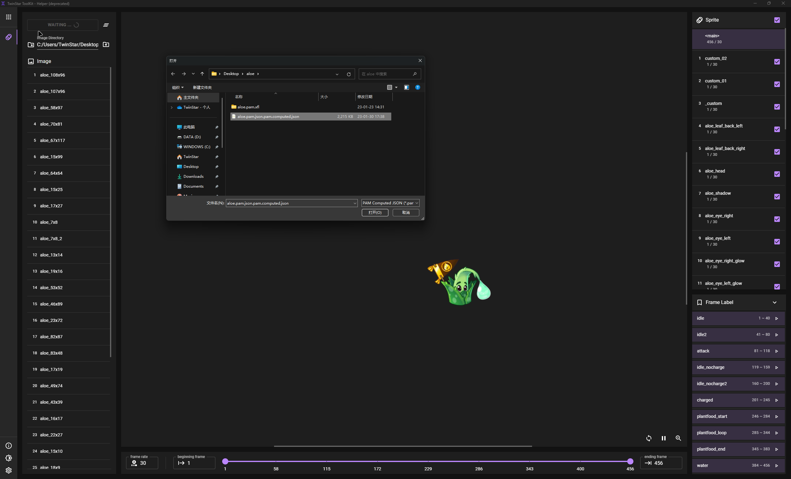

# TwinStar ToolKit - Helper (deprecated)

**这是一个废弃的项目（最后功能更新于2022-03），不会再维护，即使可能存在 BUG 。**

开发本项目的目的是作为 `TwinStar ToolKit` 的补充，但由于 CSS 动画在处理大型动画时的性能低下，这个项目被废弃了。

它能够将 `PopCap-PAM` 动画渲染为浏览器内的 `CSS` 动画以呈现给使用者，但不推荐使用它来查看一些十分复杂的动画（例如 Zomboss 、NMT 的背景动效）。

需要配合 [`TwinStar ToolKit`](https://github.com/twinkles-twinstar/TwinStar.ToolKit) 使用。

> * 本项目应该不依赖平台特性，因此可以尝试跨平台使用。
> * 用于转换PAM数据的代码只依赖 TwinStar ToolKit 的行为与 CSS-3 标准，因此可以尝试移植到移动端。

## 构建

请确保计算机以安装以下软件：

* NodeJS

* PNPM

并按照以下步骤安装依赖：

1. `> pnpm i` 安装所有依赖。

或按照以下步骤调试应用：

1. `> pnpm run start` 启动开发服务。

2. `> pnpm run electron` 启动 Electron 窗口。

或按照以下步骤打包应用：

1. `> pnpm run build` 编译脚本。

2. `> pnpm run app:dist` 打包应用。

## 使用

1. 使用 `TwinStar ToolKit` 将 `.pam` 文件解码为 `.pam.json` 文件。

2. 使用 `TwinStar ToolKit` 执行 `ComputePAM.js` 脚本，输入 `.pam.json` 的文件路径，执行完成后得到 `.pam.computed.json` 文件。

3. 启动本应用，打开 `Animation Viewer` 页面。

4. 点击左上角 `ANIMATION FILE` 按钮，在弹出的窗口选择之前得到的 `.pam.computed.json` 文件。

5. 在按钮下面的输入框中输入分解图所在的目录路径（默认将填充为 `.pam.computed.json` 文件所在目录）。

6. 现在你可以查看该 PAM 对应的动画。
